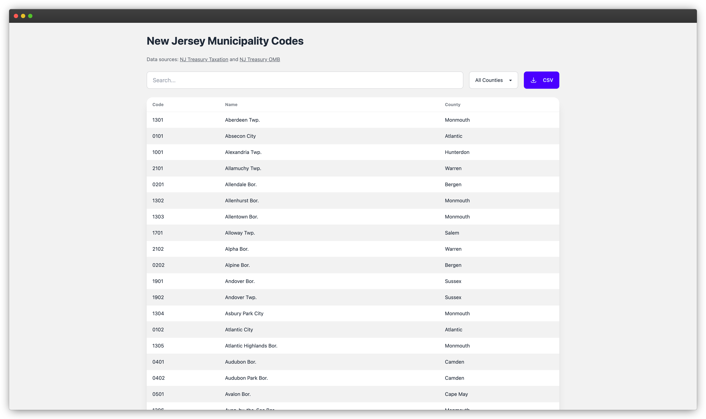

# New Jersey Municipality Codes

A simple web application to search and filter New Jersey municipality codes.
Built with vanilla JavaScript and DaisyUI.

<p align="center">
  <a href="https://njcodes.arielnathan.com">
    
  </a>
</p>

## 🌐 Live Demo

Visit [njcodes.arielnathan.com](https://njcodes.arielnathan.com)

## 🎯 Features

- Search municipalities by name or code
- Filter by county
- Responsive design
- Accessible UI with ARIA labels and screen reader support
- SEO optimized
- Back to top button for easy navigation

## 🛠️ Built With

- Vanilla JavaScript
- [TailwindCSS](https://tailwindcss.com/)
- [DaisyUI](https://daisyui.com/)

## 📝 Data Sources

- [NJ Treasury Taxation](https://www.nj.gov/treasury/taxation/pdf/lpt/cntycode.pdf)
- [NJ Treasury OMB](https://www.nj.gov/treasury/omb/pdf/forms/municodes.pdf)

## 🚀 Local Development

1. Clone the repository:

```bash
git clone https://github.com/arielnathan/njcodes.git
```

2. Navigate to the project directory:

```bash
cd njcodes
```

3. Open the `index.html` file in your browser.

## 📄 License

This project is licensed under the MIT License - see the [LICENSE](LICENSE) file
for details.

## 🤝 Contributing

Contributions are welcome! Please feel free to submit a Pull Request.

1. Fork the repository
2. Create your feature branch (`git checkout -b feature/amazing-feature`)
3. Commit your changes (`git commit -m 'Add some amazing feature'`)
4. Push to the branch (`git push origin feature/amazing-feature`)
5. Open a Pull Request
